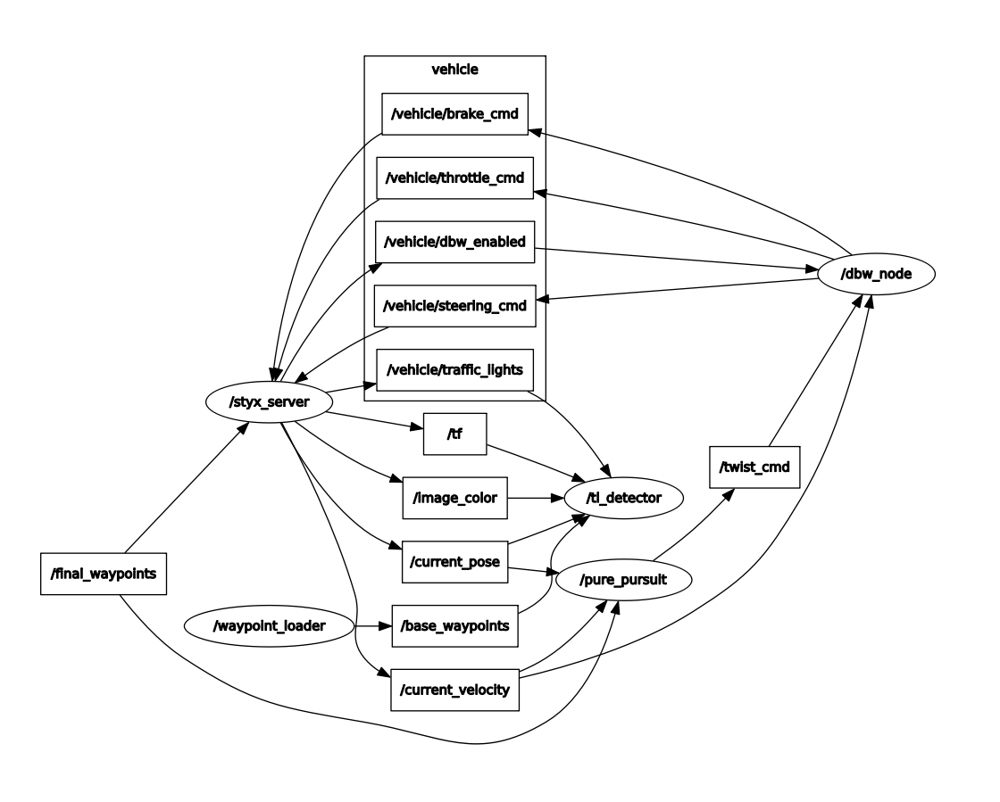

## This is 
the project repo for the final project of the Udacity Self-Driving Car Nanodegree: Programming a Real Self-Driving Car. For more information about the project, see the project introduction [here](https://classroom.udacity.com/nanodegrees/nd013/parts/6047fe34-d93c-4f50-8336-b70ef10cb4b2/modules/e1a23b06-329a-4684-a717-ad476f0d8dff/lessons/462c933d-9f24-42d3-8bdc-a08a5fc866e4/concepts/5ab4b122-83e6-436d-850f-9f4d26627fd9).


[Drive on YouTube in Highway](https://youtu.be/DZwgYNhRr4g)

[Drive on YouTube in Test course](https://youtu.be/f_IZwXv-xiE)

## Summary

In this system, 7 nodes were implemented.



(1) Waypoint loader : IN this node, all waypoints in map were loaded and published only once as "/base_waypoints".


(2) Traffic Light detector : Waypoint depending on a state of the closest traffic light was published as "/traffic_waypoint". 

If the state was red, this node published waypoint to stop in front of the light.

In the simulator, the state of the traffic light was given so this node could subscribe "/vehicle/traffic_lights" and use the infomation.

But in real world, self-driving car can not always use the infomation. So this node also has a detector and a classifier of traffic light's state using front-camera image.

・Detector : [Yolo 3 (implemeted in keras. Thank you qqwweee!)](https://github.com/qqwweee/keras-yolo3)

・Classifier : [HSV classifier, RGB classifier and Pretrained CNN (3 layer)](https://github.com/soyaoki/Intro_CarND_Traffic_Light_Classifier/blob/master/Traffic_Light_Classifier.ipynb)

The detector subscribed a RGB image "image_color" and detected ROIs (traffic light regions). Then, the ROIs were cassified 3 states (Red, Yellow and Green) by the classifier.

The reasons why YOLO3 was chosen were (1) fast, (2) easy implementation and (3) it can detect other objects like vehicle, bicycle and people for collision avoidance.

And the CNN classifier was trained by images came from [this MIT self-driving car course](https://selfdrivingcars.mit.edu/).


(3) Waypoint updater : This node published "/final_waypoints" using "/base_waypoints", "/current_pose" and "/traffic_waypoint".

This cut out the base waypoint from current vehicle position to 200 points ahead, and changed the target velocity included in waypoint depending on state of traffic light.


(4) Pure pursuit : [Pure Pursuit](https://www.ri.cmu.edu/pub_files/pub3/coulter_r_craig_1992_1/coulter_r_craig_1992_1.pdf) is one of the most famous algorithm in path tracking. 

In this time, the system use codes implementated in [Autoware?](https://github.com/autowarefoundation/autoware/tree/master/ros/src/computing/planning/motion/packages/waypoint_follower/nodes/pure_pursuit).

This node subscribed "/current_velocity", "/final_waypoints" and "/current_pose". And it published "twist_cmd" (target of linear and angular velocity, in other words, target of longitudinal velocity and yaw rate).


(5) Drive by wire : This node subscribed "/vehicle/dbw_enabled", "/current_velocity" and "twist_cmd". 

To control longitudinal velocity, a PID controller worked. And a bicycle model worked to control yaw rate.

	γ_desire = ρ * v_desire

	v_desire != v_current

	γ_desire_current = γ_desire * v_current / v_desire

	ρ_desire_current = γ_des_current / v_current

	θ　= atan(L / ρ_desire_current)

	δ = θ　* N
    

(6) Vehicle : Vehicle 

(7) Server : Server

## Classifier

In simulator, the pretrained CNN was good to classify a state of lights. But in rosbag, the RGB (classic) classifier was good to classify.


So finally the RGB classifier was chosen for main classifier.

## Preparation

Please use **one** of the two installation options, either native **or** docker installation.

## Native Installation

* Be sure that your workstation is running Ubuntu 16.04 Xenial Xerus or Ubuntu 14.04 Trusty Tahir. [Ubuntu downloads can be found here](https://www.ubuntu.com/download/desktop).
* If using a Virtual Machine to install Ubuntu, use the following configuration as minimum:
  * 2 CPU
  * 2 GB system memory
  * 25 GB of free hard drive space

  The Udacity provided virtual machine has ROS and Dataspeed DBW already installed, so you can skip the next two steps if you are using this.

* Follow these instructions to install ROS
  * [ROS Kinetic](http://wiki.ros.org/kinetic/Installation/Ubuntu) if you have Ubuntu 16.04.
  * [ROS Indigo](http://wiki.ros.org/indigo/Installation/Ubuntu) if you have Ubuntu 14.04.
* [Dataspeed DBW](https://bitbucket.org/DataspeedInc/dbw_mkz_ros)
  * Use this option to install the SDK on a workstation that already has ROS installed: [One Line SDK Install (binary)](https://bitbucket.org/DataspeedInc/dbw_mkz_ros/src/81e63fcc335d7b64139d7482017d6a97b405e250/ROS_SETUP.md?fileviewer=file-view-default)
* Download the [Udacity Simulator](https://github.com/udacity/CarND-Capstone/releases).

## Docker Installation
[Install Docker](https://docs.docker.com/engine/installation/)

Build the docker container
```bash
docker build . -t capstone
```

Run the docker file
```bash
docker run -p 4567:4567 -v $PWD:/capstone -v /tmp/log:/root/.ros/ --rm -it capstone
```

## Port Forwarding
To set up port forwarding, please refer to the [instructions from term 2](https://classroom.udacity.com/nanodegrees/nd013/parts/40f38239-66b6-46ec-ae68-03afd8a601c8/modules/0949fca6-b379-42af-a919-ee50aa304e6a/lessons/f758c44c-5e40-4e01-93b5-1a82aa4e044f/concepts/16cf4a78-4fc7-49e1-8621-3450ca938b77)

## Usage

1. Clone the project repository
```bash
git clone https://github.com/udacity/CarND-Capstone.git
```

2. Install python dependencies
```bash
cd CarND-Capstone
pip install -r requirements.txt
```
3. Make and run styx
```bash
cd ros
catkin_make
source devel/setup.sh
roslaunch launch/styx.launch
```
4. Run the simulator

## Real world testing
1. Download [training bag](https://s3-us-west-1.amazonaws.com/udacity-selfdrivingcar/traffic_light_bag_file.zip) that was recorded on the Udacity self-driving car.
2. Unzip the file
```bash
unzip traffic_light_bag_file.zip
```
3. Play the bag file
```bash
rosbag play -l traffic_light_bag_file/traffic_light_training.bag
```
4. Launch your project in site mode
```bash
cd CarND-Capstone/ros
roslaunch launch/site.launch
```
5. Confirm that traffic light detection works on real life images
